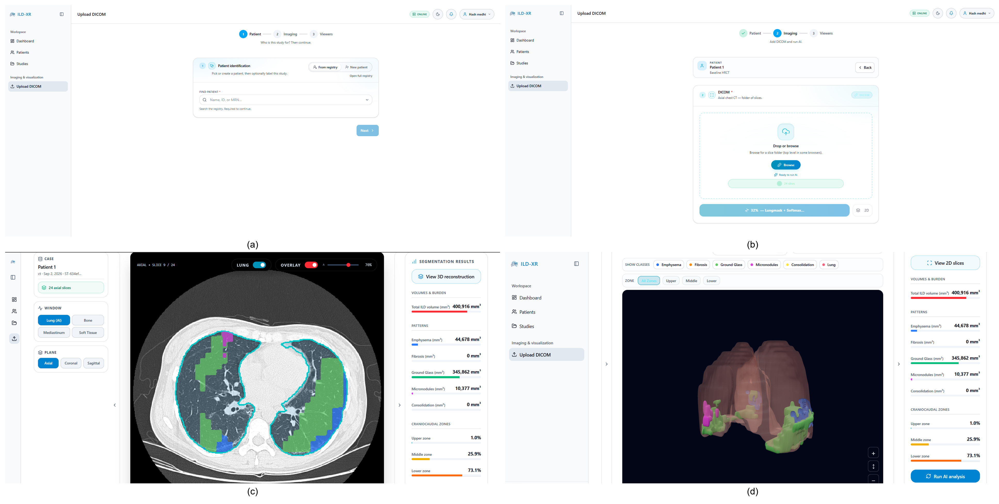

<div align="center">

# ILD-XR

**Hierarchical 3D deep learning for ILD quantitative mapping and immersive review**

[](LICENSE)
[](https://github.com/rsebany/ILD-XR/releases/tag/v1.0.0)


</div>

---

ILD-XR is an open-source platform for patient-level analysis of interstitial lung disease (ILD) on chest CT. It couples lungmask R231 preprocessing with a MedicalNet-initialized 3D residual encoder and three Softmax heads: a high-recall binary screening head (Normal vs. Any ILD, primary), a three-class fibrotic grouping, and a five-class pathology mapping from which volumetric biomarkers are derived.

The platform ships as a full-stack application: a PyTorch inference backend, a FastAPI server with PostgreSQL persistence, and a Next.js viewer with desktop 3D and browser-native WebXR review.

<p align="center">
  
</p>

ILD-XR is a visual prioritization and monitoring aid, not a standalone screening classifier: patient-level ranking remains near chance by design of the evaluation protocol, and the reported operating point reflects cohort prevalence rather than discriminative power.

## Results

Patient-disjoint stratified five-fold cross-validation on all 113 patients.

| Metric | Patch-level OOF | Patient-level cascade |
|--------|----------------|----------------------|
| F1 | 0.680 [0.614, 0.757] | **0.839 ± 0.056** |
| Recall | 0.877 [0.809, 0.942] | 0.808 ± 0.082 |
| Precision | 0.600 [0.504, 0.718] | 0.876 ± 0.039 |
| AUC-ROC | 0.693 [0.682, 0.705] | not claimed |

Calibration: binary head ECE 0.052 [0.041, 0.062] (well calibrated); dual-threshold cascade lifts patch decisions to stable patient-level flagging while retaining high recall.

## Quick Start

**Prerequisites:** Docker Desktop (recommended), or Python 3.11/3.12 + Node.js 20+ + PostgreSQL. NVIDIA GPU optional (`AI_FORCE_CPU=true` for CPU).

```bash
# 1. Clone
git clone https://github.com/rsebany/ILD-XR.git
cd ILD-XR

# 2. Environment
cp .env.example .env          # set ILD_JWT_SECRET for production

# 3. Download weights (release v1.0.0) -> backend-api/weights/
mkdir -p backend-api/weights
curl -L -o backend-api/weights/resnet_18.pth \
  https://github.com/rsebany/ILD-XR/releases/download/v1.0.0/resnet_18.pth
curl -L -o backend-api/weights/hierarchical.pth \
  https://github.com/rsebany/ILD-XR/releases/download/v1.0.0/hierarchical.pth

#    Or download manually from
#    https://github.com/rsebany/ILD-XR/releases/tag/v1.0.0

# 4. Launch
docker compose up --build -d
```

Open **http://localhost:3000**, sign up, upload a DICOM study (ZIP or folder), wait for the analysis job, then review results in 2D, 3D, or WebXR.

Verify weights loaded: `GET http://localhost:8000/health`.

No dataset download is required to run the app; volumes are uploaded directly in the UI.

## Architecture

Two-stage pipeline. Stage 1 applies fixed lungmask R231 segmentation, 1 mm isotropic resampling, HU windowing ([-1350, 150]), and normalization. Stage 2 is a ResNet-18 encoder with squeeze-and-excitation blocks, initialized from MedicalNet, processing lung-masked patches of size (16, 64, 64) with dense stride (4, 8, 8).

Three Softmax heads share the encoder:

| Head | Task | Role |
|------|------|------|
| Binary | Normal vs. Any ILD | Primary clinical claim, high-recall triage |
| Hierarchical | Normal / Fibrotic / Non-fibrotic | Fibrotic burden attribution |
| Pathology | Emphysema, Fibrosis, Ground Glass, Micronodules, Consolidation | Pattern-attributed biomarkers |

Voxel posteriors are aggregated by count-weighted sliding-window voting (median filter, kernel 3). A dual-threshold rule (pathology fraction >= 0.5% of lung volume OR mean ILD probability >= 0.45) lifts patch decisions to the patient level. Biomarker outputs include per-class lesion volumes, ILD burden capped at lung volume, and upper/middle/lower zonal distribution. Meshes are reconstructed via Marching Cubes with Taubin smoothing and exported as GLB for desktop and WebXR review.

## Project Structure

```
ILD-XR/
├── frontend/           # Next.js UI, 2D viewer, 3D meshes, WebXR sessions
│   └── components/xr/  # react-three-xr scenes, controllers, locomotion
├── backend-api/        # FastAPI server, DICOM ingestion, inference services
│   ├── services/ai/    # Sliding window, cascade, metrics, mesh export
│   ├── routes/         # Studies, patients, auth, admin
│   └── weights/        # Model checkpoints (not in git)
├── backend-ai/         # Encoder model, preprocessing, pipeline config
├── shared/             # Shared model metadata
├── Notebooks/          # Training, Phase 2 fine-tuning, ablation notebooks
└── docker-compose.yml
```

## Documentation

| Doc | Description |
|-----|-------------|
| [backend-ai/README.md](backend-ai/README.md) | Model code, preprocessing, config constants |
| [backend-api/weights/README.md](backend-api/weights/README.md) | Checkpoint layout and verification script |
| [CONTRIBUTING.md](CONTRIBUTING.md) | Contribution guidelines |
| [.env.example](.env.example) | All runtime knobs (Softmax, lungmask, GPU) |

## Dataset

Training and evaluation use a public hospital ILD CT database (113 patients) with sparse expert annotations of pathological regions. The database provides no lung-region ground truth, which is why Stage 1 uses fixed pretrained segmentation rather than a trained segmenter. Volumes are not tracked in git and are not required to run the platform.

## References

- Hofmanninger J, Cash M, Prosch H, Langs G. *Automatic lung segmentation in routine imaging is primarily a data diversity problem.* European Radiology (2020).
- Chen S, et al. *Med3D: Transfer Learning for 3D Medical Image Analysis* (2019). [MedicalNet](https://github.com/Tencent/MedicalNet)
- Depeursinge A, et al. *Building a reference multimedia database for interstitial lung diseases.* Computerized Medical Imaging and Graphics (2012).
- Lorensen WE, Cline HE. *Marching Cubes: A High Resolution 3D Surface Construction Algorithm.* SIGGRAPH (1987).
- Taubin G. *Geometric Signal Processing on Polygonal Meshes.* Eurographics (2000).

## Credits

- **WebXR / AR background:** Uses a neutral dark procedural room by default (no external asset), keeping the clinical workspace distraction-free on both desktop and mobile.

## License

Apache License 2.0, see [LICENSE](LICENSE) and [NOTICE](NOTICE).
